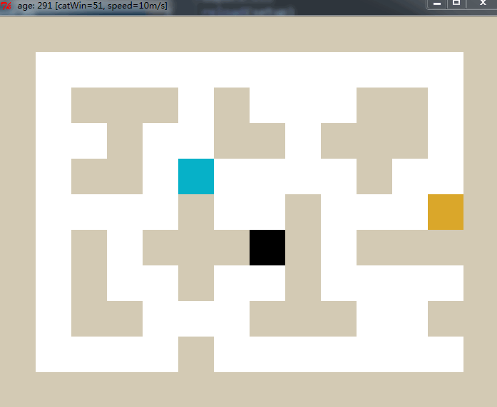
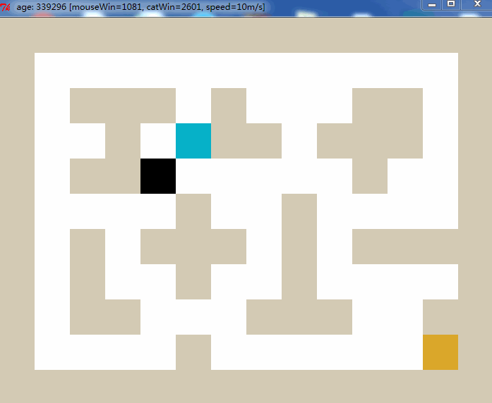

Cheesy Chase: Cat & Mouse
===================================================

<b>Cheesy Chase: Cat & Mouse</b>  is a cat-mouse-cheese game based on [Q-Learning](https://en.wikipedia.org/wiki/Q-learning). 
It uses breadth-first-search([BFS](https://en.wikipedia.org/wiki/Breadth-first_search)) when cat chasing the AI mouse, so the cat looks much more brutal :P 

## About the game
The cat consistently opts for the shortest path in its pursuit of the mouse, while the initially unsuspecting mouse remains oblivious to the looming danger of becoming the cat's prey.
* <b>Mouse wins</b> if it eats the cheese and earns reward value of 50, then a new cheese will be produced in a random grid.
* <b>cat winss</b> if it eats the mouse, the latter will gain rewards value of -100 when dead. Then it will relive in a random grid.

## Algorithm  
The basic algorithm of Q-Learning is:  
```
Q(s, a) += alpha * (reward(s,a) + gamma * max(Q(s', a') - Q(s,a))
```
    
```alpha``` is the learning rate.
```gamma``` is the value of the future reward.
It uses the best next choice of utility in later state to update the former state. 

## Example
Below we present two GIF to plot the reinforcement learning result:  
* `Blue` is for mouse.
* 'Black` is for cat.
* `Orange` is for cheese.

After **300 generations**: 



After **339300 generations**:  



By using **Q-learning algorithm**, the mouse is becoming smarter, then there will be a moment cat can never catch it again.


## Reproduce it yourself

```bash
git clone https://github.com/fancoo/QLearningMouse
cd QLearningMouse
python greedyMouse.py
```
